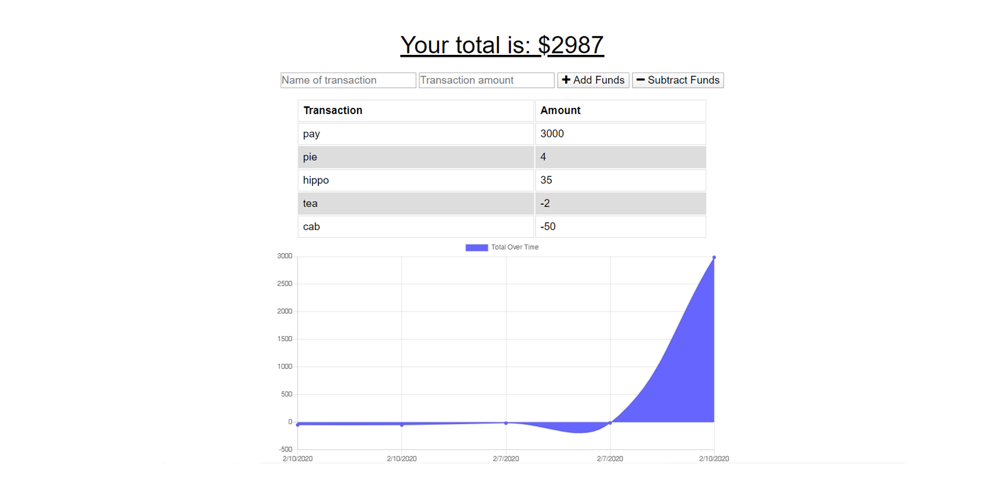

# Unit 18: PWA-Online-Offline-Budget-Tracker

For this assignment from my University of Western Australia Bootcamp, I handled creating a progressive web application where the its functionality can used while on and offline.

**Main Feature** 

1. Caching website files.
2. Storing fetch requests in browser database

**Live Demo:** https://kanes-budget-tracker.herokuapp.com/

